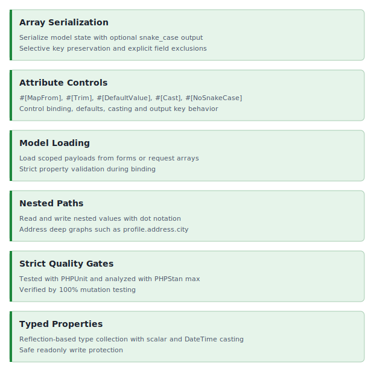

<!-- markdownlint-disable MD041 -->
<p align="center">
    <a href="https://github.com/ui-awesome/model" target="_blank">
        
    </a>
    <h1 align="center">UIAwesome Model for PHP</h1>
    <br>
</p>
<!-- markdownlint-enable MD041 -->

<p align="center">
    <a href="https://github.com/ui-awesome/model/actions/workflows/build.yml" target="_blank">
        
    </a>
    <a href="https://dashboard.stryker-mutator.io/reports/github.com/ui-awesome/model/main" target="_blank">
        
    </a>
    <a href="https://github.com/ui-awesome/model/actions/workflows/static.yml" target="_blank">
        
    </a>
</p>

<p align="center">
    <strong>Typed model mapping for modern PHP applications</strong><br>
    <em>Nested properties, explicit input mapping, trim normalization, custom casting, and selective key serialization</em>
</p>

## Features

<picture>
    <source media="(min-width: 768px)" srcset="./docs/svgs/features.svg">
    
</picture>

## Installation

```bash
composer require ui-awesome/model:^0.2
```

## Quick start

```php
<?php

declare(strict_types=1);

namespace App\Model;

use UIAwesome\Model\AbstractModel;
use UIAwesome\Model\Attribute\{Cast, MapFrom, NoSnakeCase, Timestamp, Trim};

final class User extends AbstractModel
{
    #[NoSnakeCase]
    public string $apiVersion = 'v1';

    #[MapFrom('user-email-address')]
    public string $email = '';

    #[Trim]
    public string $name = '';

    #[Cast('array')]
    public array $tags = [];

    #[Timestamp]
    private int $updatedAt = 0;
}

$model = new User();

$model->load(
    [
        'User' => [
            'apiVersion' => 'v2',
            'name' => '  Ada Lovelace  ',
            'tags' => 'php, yii2, model',
            'user-email-address' => 'ada@example.com',
        ],
    ],
);

$types = $model->getPropertyTypes();
/*
[
    'apiVersion' => 'string',
    'name' => 'string',
    'email' => 'string',
    'tags' => 'array',
    'updatedAt' => 'timestamp'
]
*/
$payload = $model->toArray(snakeCase: true, exceptProperties: ['updatedAt']);
/*
[
    'apiVersion' => 'v2',
    'name' => 'Ada Lovelace',
    'email' => 'ada@example.com',
    'tags' => ['php', 'yii2', 'model']
]
*/
```

## Explicit payload mapping with `MapFrom`

Use `#[MapFrom('external-key')]` when incoming payload keys do not follow snake_case or camelCase naming.

```php
<?php

declare(strict_types=1);

namespace App\Model;

use UIAwesome\Model\AbstractModel;
use UIAwesome\Model\Attribute\MapFrom;

final class JsonLdPayload extends AbstractModel
{
    #[MapFrom('@context')]
    public string $context = '';
}

$payload = new JsonLdPayload();

$payload->setProperties(['@context' => 'https://schema.org']);
```

## Automatic input trimming with `Trim`

Use `#[Trim]` to normalize leading and trailing spaces for string values during assignment.

```php
<?php

declare(strict_types=1);

namespace App\Model;

use UIAwesome\Model\AbstractModel;
use UIAwesome\Model\Attribute\Trim;

final class Profile extends AbstractModel
{
    #[Trim]
    public string $displayName = '';
}

$profile = new Profile();

$profile->setProperties(['display_name' => '  Ada Lovelace  ']);
```

## Forced custom casting with `Cast`

Use `#[Cast('array')]` to transform transport formats such as comma-separated strings.

```php
<?php

declare(strict_types=1);

namespace App\Model;

use UIAwesome\Model\AbstractModel;
use UIAwesome\Model\Attribute\Cast;

final class SearchFilter extends AbstractModel
{
    #[Cast('array')]
    public array $tags = [];
}

$filter = new SearchFilter();

$filter->setPropertyValue('tags', 'php, yii2, model');
```

## Preserve selected output keys with `NoSnakeCase`

Use `#[NoSnakeCase]` to keep specific property names unchanged when serializing with `snakeCase: true`.

```php
<?php

declare(strict_types=1);

namespace App\Model;

use UIAwesome\Model\AbstractModel;
use UIAwesome\Model\Attribute\NoSnakeCase;

final class ApiPayload extends AbstractModel
{
    #[NoSnakeCase]
    public string $apiVersion = 'v1';

    public string $publicEmailPersonal = 'admin@example.com';
}

$payload = new ApiPayload();

$data = $payload->toArray(snakeCase: true);
// ['apiVersion' => 'v1', 'public_email_personal' => 'admin@example.com']
```

## Documentation

For detailed configuration options and advanced usage.

- 📚 [Installation Guide](docs/installation.md)
- ⚙️ [Configuration Reference](docs/configuration.md)
- 💡 [Usage Examples](docs/examples.md)
- 🧪 [Testing Guide](docs/testing.md)
- 🛠️ [Development Guide](docs/development.md)
- 🔄 [Upgrade Guide](UPGRADE.md)

## Package information

[](https://www.php.net/releases/8.1/en.php)
[](https://packagist.org/packages/ui-awesome/model)
[](https://packagist.org/packages/ui-awesome/model)

## Quality code

[](https://codecov.io/github/ui-awesome/model)
[](https://github.com/ui-awesome/model/actions/workflows/static.yml)
[](https://github.styleci.io/repos/773929534?branch=main)

## Our social networks

[](https://x.com/Terabytesoftw)

## License

[](LICENSE)
